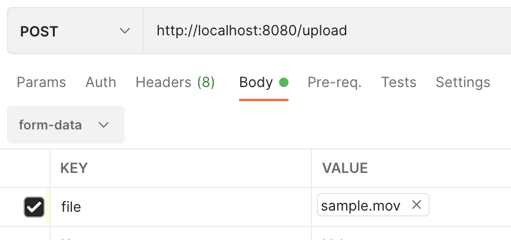
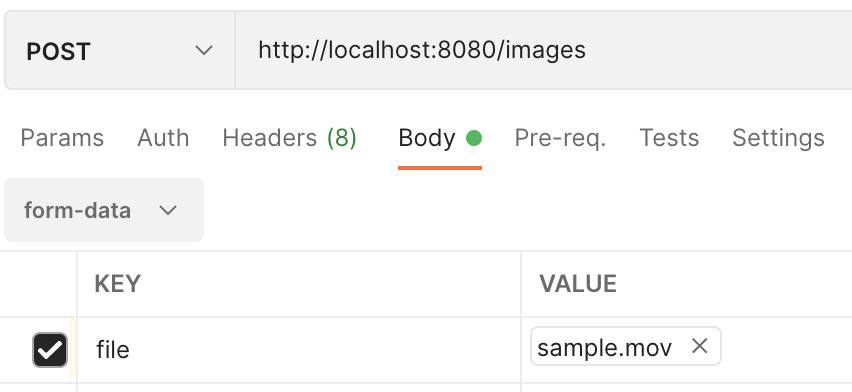

## API

* POST `/upload`
  * **Returns** image urls + video id
  * **Takes** Requestbody:
    * type = **form-data**
    * key = **file**
    * value = **the video file (e.g. \*.mov, \*.mp4 etc.)**



---

* POST `/images`
  * **Returns** all images urls for a secific video
  * **Takes** Requestbody:
    * type = **form-data**
    * key = **file**
    * value = **the video file (e.g. \*.mov, \*.mp4 etc.)**



## Deploy

`docker-compose up`

## Develop

### Prerequisites
* Java 11
  * `JAVA_HOME` set correctly
* postgres docker image (ideally `14-alpine`, but `latest` also works for now)

### Steps

1. Run:
```shell
docker run --name postgres -p 5455:5432 -e POSTGRES_USER=postgres -e POSTGRES_PASSWORD=postgres -e POSTGRES_DB=postgres -d postgres
```
2. Start Spring Application from Editor or run
   1. `mvn spring-boot:run`

Alternatively (slow):
1. `docker-compose build`
2. `docker-compose run`
